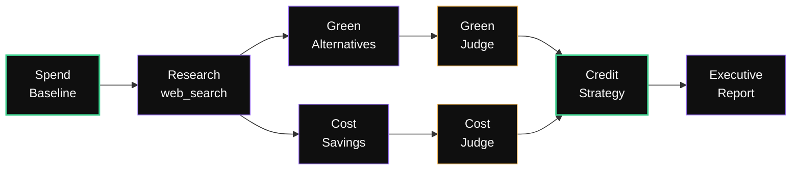
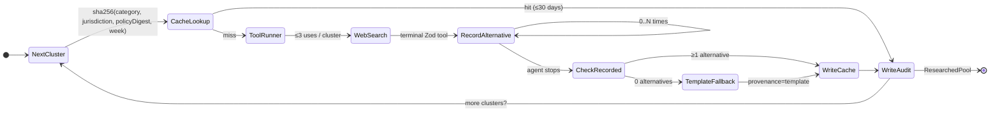
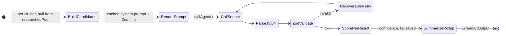
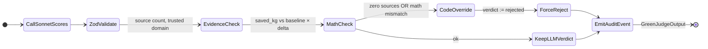
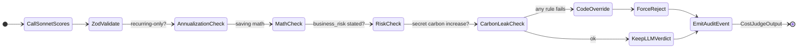
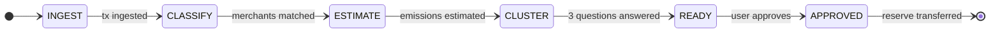

<div align="center">

<br />

# Carbo

### Agentic carbon accounting for bunq Business

*Webhook-ingested transactions → spend-based emissions with confidence ranges → agent-driven refinement → policy-routed reserve transfer → simulated EU carbon credits → CSRD ESRS E1 report.*

<br />

[](https://www.bunq.com)
[](DEMO.md)
[](#)

[](https://nextjs.org)
[](https://www.typescriptlang.org)
[](https://tailwindcss.com)
[](https://www.anthropic.com)
[](https://www.sqlite.org)
[](https://nodejs.org)

<br />

## Watch the demo

<a href="https://www.youtube.com/watch?v=7zTyIQmJTBk">
  
</a>

<br />

### **[▸ Watch the full demo on YouTube](https://www.youtube.com/watch?v=7zTyIQmJTBk)**

<sub>3 minutes · click-by-click · live bunq sandbox + real Claude</sub>

</div>

---

<div align="center">

> ### *"We turn bunq transactions into a monthly, audit-ready carbon report — and automatically fund your EU carbon reserve."*

</div>

---

## The 60-second pitch

**The problem.** The EU Omnibus Directive (Feb 2026) cut mandatory CSRD scope by ~85% — only companies with **>1,000 employees** and **>€450M turnover** must report, starting FY2027.[^1] But that didn't make the work disappear: it pushed it down the supply chain. SMEs now face a flood of carbon-data requests from large customers and banks, capped at the **VSME** (Voluntary SME Standard, EFRAG → European Commission, July 2025).[^2] The current options are bad: SaaS tooling runs **€1k–€5k/year for the light tier**, in-depth consulting **starts at €10k+**, and enterprise platforms **€2k–€25k+/year**.[^3] Manual VSME drafts take weeks.[^4]

**The insight.** bunq Business already has the only signal a credible estimate needs: *what was bought, from whom, for how much.*

**The build.** Carbo plugs into the bunq webhook in minutes. Every transaction becomes a calibrated emissions estimate with an explicit confidence range. Once a month, an **8-agent DAG** runs, surfaces **2–3 refinement questions** (only the high-spend low-confidence ones), and proposes a **reserve transfer + EU carbon-credit allocation**. The user clicks **Approve & transfer €X**. Money moves from the main bunq account to a **bunq Reserve sub-account**, recorded on a **SHA-256 hash-chained audit ledger** that satisfies an external auditor.

**The demo numbers** *(measured from the seeded SQLite, not aspirational)*. 181 transactions over 90 days · €54,730 total spend · ~7.5 tCO₂e per monthly close · EU credits split across biochar / peatland / reforestation · CSRD ESRS E1-6 + E1-7 report · audit chain valid.

[^1]: [Council of the EU — Omnibus simplification press release, Feb 2026](https://www.consilium.europa.eu/en/press/press-releases/2026/02/24/council-signs-off-simplification-of-sustainability-reporting-and-due-diligence-requirements-to-boost-eu-competitiveness/) · [BDO — CSRD post-Omnibus revised scope](https://www.bdo.com/insights/sustainability-and-esg/csrd-post-omnibus-revised-scope-and-requirements)
[^2]: [European Commission — VSME recommendation](https://finance.ec.europa.eu/publications/commission-presents-voluntary-sustainability-reporting-standard-ease-burden-smes_en) · [EFRAG — SMEs and Sustainability Reporting](https://www.efrag.org/en/smes-and-sustainability-reporting)
[^3]: [D-Carbonize — Carbon accounting cost breakdown](https://d-carbonize.eu/blog/carbon-accounting-cost/) · [EcoHedge — Cost of carbon accounting for SMEs](https://www.ecohedge.com/blog/how-much-does-carbon-accounting-cost-for-smes/)
[^4]: [GoClimate — Comparing the Top 5 VSME Tools](https://www.goclimate.com/knowledge/articles/comparing-the-top-5-vsme-tools)

---

## Contents

| | |
|---|---|
| **[Why it's novel](#whats-novel)** | The 5 ideas judges should leave with |
| **[The agentic DAG](#the-agentic-dag)** | 8-agent reasoning layer with code-adjudicated judges |
| **[The close state machine](#the-close-state-machine)** | DB-persisted, idempotent, replayable |
| **[Quickstart](#quickstart)** | `npm install && npm run dev` — under 90 seconds |
| **[Demo flow](#demo-flow-3-minutes)** | What to click, in what order |
| **[Stack](#stack)** | Locked-in choices and why |
| **[Emission estimation](#emission-estimation)** | Spend-based, GHG Scope 3 Cat 1 |
| **[Judge guide](#judge-guide)** | Criteria → evidence map |
| **[bunq integration](#bunq-integration)** | Native primitives end-to-end |
| **[Architecture & docs](#architecture--agent-docs-read-first)** | Read these before editing |
| **[Directory map](#directory-map)** | Where everything lives |
| **[Real vs simulated](#whats-real-vs-simulated)** | Honest scope |

---

## What's novel

| | |
|---|---|
| **8-agent DAG, not a chatbot** | `lib/agents/dag/` — Baseline → Research → [Green Alt ‖ Cost Savings] → [Green Judge ‖ Cost Judge] → Credit Strategy → Executive Report. See [`docs/agents/00-overview.md`](docs/agents/00-overview.md). |
| **LLMs author, code adjudicates** | `greenJudge` and `costJudge` re-verify math and source-evidence in code; their verdicts can flip the LLM's. Credit-strategy and report numbers are computed **before** the LLM sees them. The LLM cannot move money or invent savings. |
| **DB-persisted state machines** | 12-state close, 10-state onboarding. No LangGraph, no Temporal. Every transition is `WHERE state = ...` — idempotent, replayable, restart-safe. |
| **SHA-256 hash-chained ledger** | `lib/audit/append.ts`. Append-only via SQL trigger. Tampering breaks `verifyChain` on the next read. `/ledger` renders a live "Chain valid" badge. |
| **Quadrature confidence rollup** | `lib/emissions/estimate.ts`. Variance-correct, spend-weighted; refine-Q clustering on `spend × (1 − confidence)` so we only ask about transactions that matter. |

---

## The agentic DAG

Entry point: `POST /api/impacts/research`. Baseline is deterministic; everything downstream uses Sonnet 4.6 with code-side judges that can override LLM verdicts on hard rules (zero-sources, math mismatch).



| Node | Model | Authority |
|---|---|---|
| **Spend Baseline** | deterministic | Source of truth for spend + emissions |
| **Research** | Sonnet 4.6 + `web_search_20250305` (30-day cache) | Suggests green alternatives + price intel |
| **Green Alternatives** | Sonnet 4.6 | Proposes switches with payback math |
| **Cost Savings** | Sonnet 4.6 | Proposes savings with payback math |
| **Green Judge** | Sonnet 4.6 → **code override** | Validates evidence + math; can flip verdict |
| **Cost Judge** | Sonnet 4.6 → **code override** | Validates evidence + math; can flip verdict |
| **Credit Strategy** | deterministic | Allocates reserve across EU credit projects |
| **Executive Report** | Sonnet 4.6 | Writes prose **on top of frozen numbers** |

### Per-agent state machines

Each agent is its own micro-FSM. Click any one to see what it ingests, how it transitions, and what flows out.

<details>
<summary><b>01 — Spend Baseline</b> · deterministic · <code>lib/agents/dag/spendBaseline.ts</code></summary>

| | |
|---|---|
| **Ingests** | `{ orgId, month }` + raw `transactions` rows + factor library |
| **Emits** | `BaselineOutput` → Research, Green Alt, Cost Savings |
| **Authority** | Source of truth for spend, emissions, and the priority-target list |

```mermaid
stateDiagram-v2
    direction LR
    [*] --> LoadTx: orgId, month
    LoadTx --> AggregateByCategory: rows
    AggregateByCategory --> EstimatePerTx: getEmissionFactor()
    EstimatePerTx --> RollupConfidence: per-tx point + low/high
    RollupConfidence --> ClusterPrioritize: variance-correct, spend-weighted
    ClusterPrioritize --> CapTo20: spend × (1 − confidence)
    CapTo20 --> SplitByNextAgent: green / cost / both
    SplitByNextAgent --> [*]: priority_targets[]
```



**Hard rules:** never pass raw rows downstream · cap at 20 priority clusters · always include `baseline_confidence` · raise a `required_context_question` instead of guessing column meaning.

</details>

<details>
<summary><b>02 — Research</b> · Sonnet 4.6 + <code>web_search_20250305</code> · <code>lib/agents/dag/research.ts</code></summary>

| | |
|---|---|
| **Ingests** | `BaselineOutput.priority_targets` + `agentRunId` + org context |
| **Emits** | `ResearchOutput` / `ResearchedPool` keyed by `cluster_id` → Green Alt + Cost Savings |
| **Authority** | Owns the alternative-candidate set; downstream proposers cannot invent vendors |



**Fallback ladder:** live `web_search` → cache (≤30d) → `GREEN_TEMPLATES` → empty (surfaced as `limitations[]` in the report). Every recorded alternative carries ≥1 source URL; Zod blocks prompt-injected URLs at the tool boundary.

</details>

<details>
<summary><b>03 — Green Alternatives</b> · Sonnet 4.6 plain JSON · <code>lib/agents/dag/greenAlternatives.ts</code></summary>

| | |
|---|---|
| **Ingests** | `baseline` + `researchedPool` (pre-resolved candidates per cluster) |
| **Emits** | `GreenAltOutput` → Green Judge |
| **Authority** | Picks **which** alternative from the pool — cannot invent new ones |



**Hard rules:** carbon-first (cost is supporting context only) · separate reduction from offsetting · `recommendation_status ∈ {recommend_switch, recommend_if_policy_allows, needs_context, no_viable_alternative_found, no_action_needed, reserve_or_offset_after_reduction_review}`.

</details>

<details>
<summary><b>04 — Cost Savings</b> · Sonnet 4.6 plain JSON · <code>lib/agents/dag/costSavings.ts</code></summary>

| | |
|---|---|
| **Ingests** | `baseline` + `researchedPool` |
| **Emits** | `CostSavingsOutput` → Cost Judge |
| **Authority** | Proposes vendor-switch / consolidation / bulk / cancellation options with payback math |

```mermaid
stateDiagram-v2
    direction LR
    [*] --> DetectRecurring: SQL on bunqPaymentDate
    DetectRecurring --> AnnotateClusters: recurring vs one-time
    AnnotateClusters --> RenderPrompt
    RenderPrompt --> CallSonnet
    CallSonnet --> ParseJSON
    ParseJSON --> ZodValidate
    ZodValidate --> AnnualizeRecurringOnly: rule 5
    AnnualizeRecurringOnly --> FlagBusinessRisk: low / medium / high
    FlagBusinessRisk --> SummarizeRollup
    SummarizeRollup --> [*]: CostSavingsOutput
```



**Hard rules:** never invent live prices without a benchmark source · annualize **only** recurring savings · flag business risk on every cancellation candidate · preserve carbon side-effects (`lower / neutral / higher / unknown`).

</details>

<details>
<summary><b>05 — Green Judge</b> · Sonnet 4.6 → <b>code override</b> · <code>lib/agents/dag/greenJudge.ts</code></summary>

| | |
|---|---|
| **Ingests** | `greenAlt` + `researchedPool` (for source re-verification) |
| **Emits** | `GreenJudgeOutput` → Credit Strategy |
| **Authority** | LLM scores + writes prose; **code can override the verdict** on hard-rule failure |



**Hard rules:** vague sustainability claims rejected · `green_score ∈ [0..100]` mapped to `{approved | approved_with_caveats | needs_context | rejected}` · every verdict written as a signed `auditEvents` row so the report can render a "judged-by" signature.

</details>

<details>
<summary><b>05a — Cost Judge</b> · Sonnet 4.6 → <b>code override</b> · <code>lib/agents/dag/costJudge.ts</code></summary>

| | |
|---|---|
| **Ingests** | `costSavings` + `researchedPool` + historical spend |
| **Emits** | `CostJudgeOutput` → Credit Strategy |
| **Authority** | Same code-override pattern as Green Judge — LLM scores, code enforces |



**Hard rules:** no fake savings · no bad annualization · no ignored business risk · no silent carbon increase · `cost_score` mapped onto the same 4-verdict set as Green Judge.

</details>

<details>
<summary><b>06 — Credit Strategy</b> · deterministic + Sonnet 4.6 prose labels · <code>lib/agents/dag/creditStrategy.ts</code></summary>

| | |
|---|---|
| **Ingests** | `greenJudge` + `costJudge` + `baseline` (only `approved` / `approved_with_caveats`) |
| **Emits** | `CreditStrategyOutput` → Executive Report |
| **Authority** | Numbers are **frozen by code** before the LLM sees them; LLM only writes `cfo_summary` + picks credit-type label |


**Canonical formula** (deterministic, audit-replayable):

```
net = direct_cost_saving + tax_deduction_value + subsidy_or_grant_value
    + avoided_carbon_tax_or_ets_cost + avoided_offset_purchase_cost
    - implementation_cost - operational_risk_adjustment
```

The audit row hashes `{greenJudgeApprovedCount, costJudgeApprovedCount, baselineTotalSpendEur, baselineTotalTco2e}` — a sign-flip in `compute()` is detectable by re-hashing the same four inputs.

</details>

<details>
<summary><b>07 — Executive Report</b> · Sonnet 4.6 (optional summary) · <code>lib/agents/dag/executiveReport.ts</code></summary>

| | |
|---|---|
| **Ingests** | `greenJudge` + `costJudge` + `creditStrategy` + `baseline` + `research` |
| **Emits** | `ExecReportOutput` → `/report/[month]` dashboard + CSRD export + `/presentation` |
| **Authority** | Numbers and matrix are deterministic; the LLM only writes the executive prose |


**Matrix logic:** low-cost / low-carbon = best · high-cost / low-carbon = ESG-positive but finance-sensitive · low-cost / high-carbon = cost-saving but carbon-risk · high-cost / high-carbon = avoid. Rejected items never appear; their reason is surfaced in `limitations[]`.

</details>

---

## The close state machine

12 states, DB-persisted, every transition guarded by `WHERE state = ...`. The pipeline animates through these on `/close/[id]`.



| State | Copy |
|---|---|
| `INGEST` | "Ingesting transactions…" |
| `CLASSIFY` | "Matching merchants…" |
| `ESTIMATE` | "Estimating emissions…" |
| `CLUSTER` | "We have 3 questions." |
| `READY` | "Ready to approve." |
| `APPROVED` | "Reserve transferred." |

---

## Quickstart

> **Heads up.** Use **Node 22 LTS** (`.nvmrc` pins it). Do **not** run on Node 25 — its higher memory baseline plus `better-sqlite3`'s native rebuild has been observed to wedge 18GB MacBooks during install.

```bash
nvm use            # or: fnm use
npm install
npm run migrate    # creates ./data/carbon.db
npm run seed       # 61 sandbox transactions across 90 days
npm run dev
```

Open <http://localhost:3000> → click **Run Carbon Close**.

### Environment

Copy `.env.example` to `.env.local`. Defaults are mock-only — no external API keys needed to demo.

```bash
ANTHROPIC_MOCK=1   # 1 = stub LLM. 0 = real (needs ANTHROPIC_API_KEY).
BUNQ_MOCK=1        # 1 = stub bunq. 0 = real (needs API key + signing key).
DRY_RUN=1          # 1 = don't actually move money via bunq.
```

### Reset the demo

```bash
npm run reset      # wipes + re-seeds. Restart `npm run dev` afterward
                   # so the DB handle isn't stale.
```

### Run the DAG end-to-end (with real Claude)

```bash
export ANTHROPIC_API_KEY=sk-ant-...
export ANTHROPIC_MOCK=0
npm run dev
# in another shell:
curl -X POST http://localhost:3000/api/impacts/research \
  -H 'content-type: application/json' \
  -d '{"month":"2026-03"}' | jq
```

---

## Demo flow (3 minutes)

> **TL;DR.** Run Carbon Close → answer 3 refinement questions → approve → see CSRD report + signed audit chain.
> Click-by-click with expected screen text in [`DEMO.md`](DEMO.md).

| # | Route | What you see |
|---|---|---|
| 1 | **`/`** | Dashboard — 181 tx over 90 days, €54.7k spend. Click **Run Carbon Close**. |
| 2 | **`/close/[id]`** | Pipeline animates `INGEST → CLASSIFY → ESTIMATE → CLUSTER`. Pauses at 3 refinement questions surfaced by spend-weighted uncertainty. |
| 3 | (modal) | Answer each → confidence rises (method flips `spend_based → refined`). |
| 4 | **`/close/[id]`** | Proposed actions — reserve transfer + ~7.5 tCO₂e of EU credits across biochar / peatland / reforestation. Click **Approve & execute**. |
| 5 | **`/report/2026-04`** | CSRD ESRS E1-6 + E1-7 report, ready for export. |
| 6 | **`/ledger`** | SHA-256 chain renders a live "Chain valid" badge. |
| 7 | **`/impacts`** | Cost-vs-carbon 2×2 matrix of switch recommendations. |
| 8 | **`/presentation`** | Interactive scroll-sync deck of the DAG. |

---

## Stack

| Layer | Choice | Why |
|---|---|---|
| Framework | **Next.js 16** App Router, TypeScript, Tailwind 4, Recharts | Server components by default, route handlers for the bunq webhook |
| Database | **SQLite** via better-sqlite3 + **Drizzle ORM** | Hash-chained `audit_events` via SQL trigger; zero-deps deploy |
| LLMs | **Anthropic TS SDK** — Haiku 4.5 (classify), Sonnet 4.6 (refine + CSRD) | No Opus. Tool-use only; Zod-validated outputs |
| Banking | **bunq** thin client, RSA-SHA256 signing, webhook verify | Mock-first; flip `BUNQ_MOCK=0` for live sandbox |
| Factors | DEFRA 2024 / ADEME / Exiobase, **hardcoded** in `lib/factors/` | No external API calls; every row keeps its `source` |
| Tunnel | Cloudflare Tunnel | Stable webhook URL across restarts |

---

## Emission estimation

Spend-based emission factors (GHG Protocol Scope 3, Category 1). Each transaction's EUR amount × category-specific factor (kg CO₂e per EUR). Factors from **DEFRA 2024**, **ADEME Base Carbone**, and **Exiobase** — all hardcoded in `lib/factors/index.ts`, no external API calls.

The Claude API handles the intelligence layer: classifying merchants into the right emission category, generating refinement questions to reduce uncertainty, and writing CSRD-compliant narratives.

```text
confidence = (1 − factor_uncertainty) × classifier_confidence × tier_weight
rollup     = quadrature-summed variance, spend-weighted confidence
cluster    = group transactions by spend × (1 − confidence) — surface the highest first
```

---

## Judge guide

| Criterion | Weight | Where it shows up | Anchor |
|---|---|---|---|
| **Impact & usefulness** | 30% | CSRD report, tax-savings + reserve loop, real bunq transfer, switch recommendations | [JUDGE §1](JUDGE.md#1-impact--usefulness--30) |
| **Creativity & innovation** | 25% | 8-agent DAG with code-adjudicated judges, refine-Q clustering, hash-chained ledger, DB-persisted state machines | [JUDGE §2](JUDGE.md#2-creativity--innovation--25) |
| **Technical execution** | 20% | Idempotent state transitions, quadrature confidence math, Zod-validated tool_use, prompt-cached system prompts | [JUDGE §3](JUDGE.md#3-technical-execution--20) |
| **bunq integration** | 15% | RSA-SHA256 signing, 3-leg OAuth, sub-accounts, signed-webhook ingest, intra-user transfer | [JUDGE §4](JUDGE.md#4-bunq-integration--15) |
| **Pitch** | ~10% | One-pager `PITCH.md`, click-by-click `DEMO.md`, in-app `/presentation` deck | [JUDGE §5](JUDGE.md#5-pitch--10) |

[`JUDGE.md`](JUDGE.md) is the single-page **claim → file evidence → run-to-verify** map.
[`PITCH.md`](PITCH.md) is the 60-second narrative.
[`DEMO.md`](DEMO.md) is the click-by-click demo with expected screen output.

---

## bunq integration

Native bunq Business primitives end-to-end:

- **Signed API client** — RSA-SHA256 (`lib/bunq/signing.ts` + `lib/bunq/client.ts`).
- **3-leg auth** — installation → device → session.
- **Sub-accounts** — main + Carbo Reserve, created via API.
- **Webhook + signature verification** — every inbound transaction validated.
- **Intra-user transfer** — main → reserve, with structured description.

7 automation scripts under `scripts/bunq-*.ts`:

| Script | Purpose |
|---|---|
| `bunq:keygen` | Generate RSA keypair for signing |
| `bunq:sandbox-user` | Create sandbox user |
| `bunq:bootstrap` | Full install + device + session |
| `bunq:create-reserve` | Create the Carbo Reserve sub-account |
| `bunq:sugardaddy` | Seed sandbox balance |
| `bunq:backfill-notes` | Backfill historical descriptions |
| `bunq:register` | Register the webhook URL |

Defaults are safe (`BUNQ_MOCK=1`, `DRY_RUN=1`); flip one flag for live sandbox, no code changes.

---

## Architecture & agent docs (read first)

The reasoning layer is an **8-agent DAG** under `lib/agents/dag/`. Entry point: `POST /api/impacts/research`.

Read in this order before editing any agent:

1. [`docs/agents/00-overview.md`](docs/agents/00-overview.md) — DAG diagram, model split, authority boundaries, persistence tables, entry-point routes.
2. [`docs/architecture-comparison.md`](docs/architecture-comparison.md) — original-plan-vs-reality, drift section, parallel-path inventory, migration order.
3. The per-agent doc you're touching: [`docs/agents/01-spend-baseline.md`](docs/agents/01-spend-baseline.md) … [`07-executive-report.md`](docs/agents/07-executive-report.md), plus [`08-research.md`](docs/agents/08-research.md). Each contains the agent's full system prompt + I/O schema + gap-vs-current-code.
4. The relevant Forge spec under [`.forge/specs/`](.forge/specs/): `spec-baseline-agent.md` (shipped), `spec-dag-hardening.md` (next round — credit-strategy audit, mock-fallback observability, researchCache leakage fix, Annual Savings Forecaster, path consolidation, close-machine integration).
5. Cross-cutting research briefs in [`research/`](research/) — especially [`research/13-context-scaling-patterns.md`](research/13-context-scaling-patterns.md) (token budgets, chunking, prompt caching) and [`research/13-tax-savings-incentives.md`](research/13-tax-savings-incentives.md) (Dutch EIA/MIA/Vamil + EU ETS math feeding the credit strategy).

---

## Directory map

```
carbo/
├── app/                     Next routes — pages + API routes
│  └── api/impacts/          /api/impacts/research = canonical DAG runner
├── lib/
│  ├── agents/dag/           8-agent DAG (Baseline → … → Executive Report)
│  ├── agent/                onboarding suite, 12-state close machine, impact-analysis
│  ├── bunq/                 signed HTTP client, webhook verify, sub-accounts, payments
│  ├── classify/             rule-first + LLM-fallback merchant classifier + cache
│  ├── factors/              hardcoded spend-based factors (DEFRA / ADEME / Exiobase)
│  ├── emissions/            per-tx point + low/high + confidence; quadrature rollup
│  ├── policy/               Zod-validated policy DSL + evaluator
│  ├── credits/              simulated EU carbon-credit projects
│  ├── tax/                  EIA/MIA/Vamil + EU ETS math feeding credit strategy
│  ├── audit/                SHA-256 hash-chained append-only ledger
│  ├── anthropic/            Anthropic SDK wrapper + mock mode
│  └── impacts/              persistDagRun() — writes agentRuns + agentMessages
├── docs/                    architecture-comparison, agents/00-overview, per-agent docs
├── .forge/                  shared specs and task frontiers
├── research/                domain briefs that feed the agents (01..13)
└── scripts/                 migrate / seed / reset / bunq bootstrap / DAG smoke
```

---

<div align="center">

<br />

### **Built in 24 hours for bunq Hackathon 7.0**

<br />

[**▸ Watch the demo**](https://www.youtube.com/watch?v=7zTyIQmJTBk) · [Pitch](PITCH.md) · [Demo script](DEMO.md) · [Judge guide](JUDGE.md) · [Architecture](ARCHITECTURE.md) · [Design system](DESIGN.md) · [Agent docs](docs/agents/00-overview.md)

<sub>Made with care · Carbon-aware · Audit-grade</sub>

<br />

</div>
